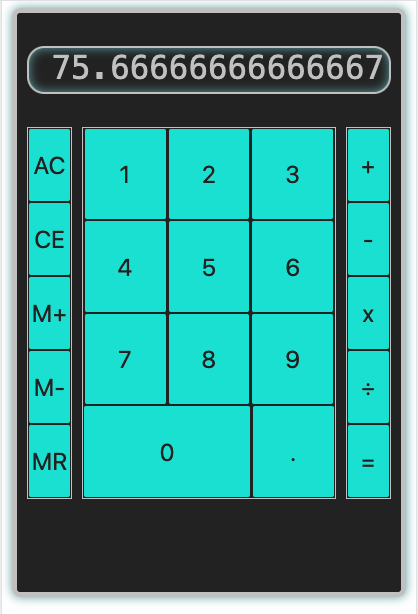

# APPLICATION #4: CALCULATOR APP

## A JavaScript calculator.

[View the calculator live](https://skillitzimberg.github.io/calculator-app/).  

## Summary

This the fourth app on my roadmap part of the Software Development Mastermind program. Building this app got more familiar with JavaScript classes and classes in general. I also gained a sense of fluidity in working with event delegation and how the organization of the HTML can really make things easier on the logic side.

The expectations for the project are described in [DELIVERABLES](./DELIVERABLES.md).

The steps I took and other errata encountered while building are in [PLANNING](./PLANNING.md). I tried my best to have the commits track closely with this document.

## Author

Scott Bergler :: Full Stack Developer > [LinkedIn](https://www.linkedin.com/in/scott-bergler/) | [Personal Website](https://oceancode.dev/)
